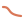

**hi** &nbsp;—&nbsp; I'm Téo. I build small, focused tools.

<p>
&nbsp;&nbsp;<b><a href="https://github.com/teolbb/curveforge">curveforge</a></b> &nbsp;—&nbsp; Python library that builds Dirac Live target curves. &nbsp;<a href="https://pypi.org/project/curveforge/"> pypi</a>
</p>

```sh
pip install curveforge
```

<p>
&nbsp;&nbsp;<b><a href="https://github.com/teolbb/curveforge-ui">curveforge-ui</a></b> &nbsp;—&nbsp; browser playground &mdash; eight target curves, composable EQ, A/B compare, live audio preview. &nbsp;<a href="https://teolbb.github.io/curveforge-ui/"> live</a>
</p>

More soon.

<br>

<picture>
  <source media="(prefers-color-scheme: dark)" srcset="header-dark.svg">
  
</picture>
